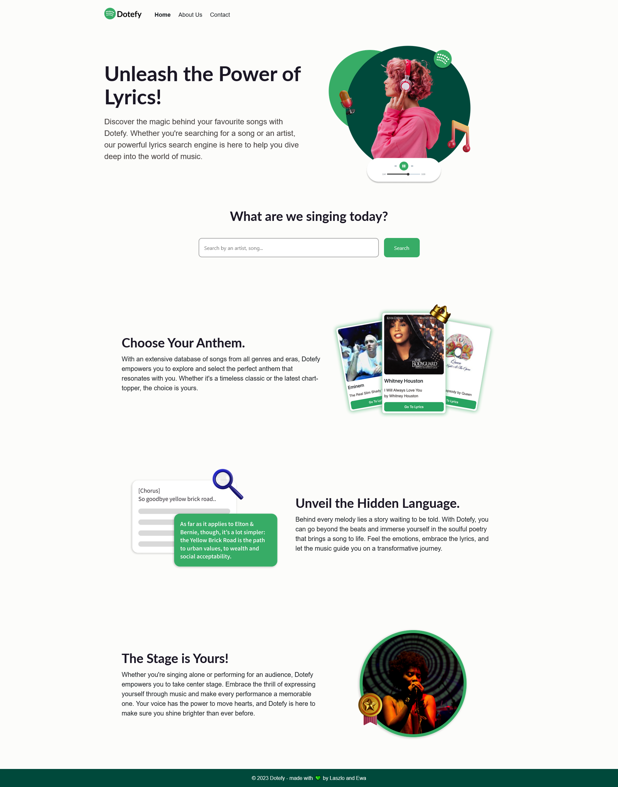

# Dotefy - lyrics search

## Description

Dotefy is a innovative lyrics search web app that helps you discover the deeper meaning of music.\
Powered by the Genius API, our platform empowers you to unravel the artist's true intentions and dive into the depths of their musical genius.

## Concept
Inspired by “you need to use at least 2 technologies that we haven’t used in class”, we decided to create a web app that focuses on music.\
We wanted to create something fun and beautiful looking.  \
An app that helps you rediscover your favourites songs as you sing them out loud, sounded like a great idea! 🌟

## User Story
* "As a user I want to be able to look for my favourite songs."
* "As a user I want to click on the found songs to view their lyrics, and see the meaning behind them"

## Live URL

https://dotefy.netlify.app/

## Technologies used
* React
* Node
* React Spring for animation
* Postman mocking server to accept POST requests
* Genius Search API
* Netlify as a host for the live app
* Figma for design and graphics

## Team members
### Design 
* Ewa Górka: https://github.com/ewagorka/
  * HTML, CSS, Spring animation
### Programming 
* László Somogyi: https://github.com/laszlosomogyimusic
  * React skeleton, Genius API, Postman mocking server

## Mockup
